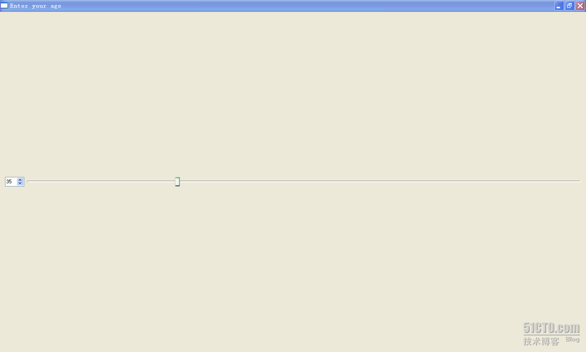
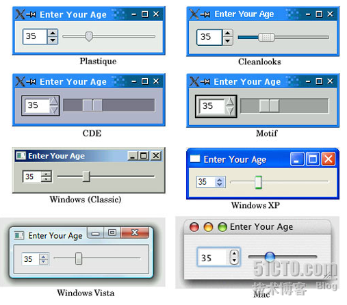

# Qt 学习之路(5)：组件布局

同 Swing 类似，Qt 也提供了几种组件定位的技术。其中就包括绝对定位和布局定位。
 
顾名思义，绝对定位就是使用最原始的定位方法，给出这个组件的坐标和长宽值。这样，Qt 就知道该把组件放在哪里，以及怎么设置组件的大小了。但是这样做的一个问题是，如果用户改变了窗口大小，比如点击了最大化或者拖动窗口边缘，这时，你就要自己编写相应的函数来响应这些变化，以避免那些组件还只是静静地呆在一个角落。或者，更简单的方法是直接禁止用户改变大小。
 
不过，Qt 提供了另外的一种机制，就是布局，来解决这个问题。你只要把组件放入某一种布局之中，当需要调整大小或者位置的时候，Qt 就知道该怎样进行调整。这类似于 Swing 的布局管理器，不过 Qt的布局没有那么多，只有有限的几个。
 
来看一下下面的例子：

```
#include <QtGui/QApplication> 
#include <QtGui/QWidget> 
#include <QtGui/QSpinBox> 
#include <QtGui/QSlider> 
#include <QtGui/QHBoxLayout> 
 
int main(int argc, char *argv[]) 
{ 
        QApplication app(argc, argv); 
        QWidget *window = new QWidget; 
        window->setWindowTitle("Enter your age"); 
 
        QSpinBox *spinBox = new QSpinBox; 
        QSlider *slider = new QSlider(Qt::Horizontal); 
        spinBox->setRange(0, 130); 
        slider->setRange(0, 130); 
 
        QObject::connect(slider, SIGNAL(valueChanged(int)), spinBox, SLOT(setValue(int))); 
        QObject::connect(spinBox, SIGNAL(valueChanged(int)), slider, SLOT(setValue(int))); 
        spinBox->setValue(35); 
 
        QHBoxLayout *layout = new QHBoxLayout; 
        layout->addWidget(spinBox); 
        layout->addWidget(slider); 
        window->setLayout(layout); 
 
        window->show(); 
 
        return app.exec(); 
}
```

这里使用了两个新的组件：QSpinBox 和 QSlider，以及一个新的顶级窗口 QWidget。QSpinBox 是一个有上下箭头的微调器，QSlider 是一个滑动杆，只要运行一下就会明白到底是什么东西了。
 
代码并不是那么难懂，还是来简单的看一下。首先创建了一个 QWidget 的实例，调用 setWindowTitle 函数来设置窗口标题。然后创建了一个 QSpinBox 和 QSlider，分别设置了它们值的范围，使用的是 setRange 函数。然后进行信号槽的链接。这点后面再详细说明。然后是一个QHBoxLayout，就是一个水平布局，按照从左到右的顺序进行添加，使用 addWidget 添加好组件后，调用 QWidget 的 setLayout 把 QWidget 的 layout 设置为我们定义的这个 Layout，这样，程序就完成了！
 
编译运行一下，可以看到效果：


如果最大化的话：



虽然我并没有添加任何代码，但是那个 layout 就已经明白该怎样进行布局。
 
或许你发现，那两个信号槽的链接操作会不会产生无限递归？因为 steValue 就会引发 valueChanged信号！答案是不会。这两句语句实现了，当 spinBox 发出 valueChanged 信号的时候，会回调slider 的 setValue，以更新 slider 的值；而 slider 发出 valueChanged 信号的时候，又会回调 slider 的 setValue。但是，如果新的 value 和旧的 value 是一样的话，是不会发出这个信号的，因此避免了无限递归。
 
迷糊了吧？举个例子看。比如下面的 spinBox->setValue(35)执行的时候，首先，spinBox 会将自己的值设为35，这样，它的值与原来的不一样了(在没有 setValue 之前的时候，默认值是0)，于是它发出了 valueChanged 信号。slider 接收到这个信号，于是回调自己的 setValue 函数，将它的值也设置成35，它也发出了 valueChanged 信号。当然，此时 spinBox 又收到了，不过它发现，这个35和它本身的值是一样的，于是它就不发出信号，所以信号传递就停止了。
 
那么，你会问，它们是怎么知道值的呢？答案很简单，因为你的信号和槽都接受了一个int参数！新的值就是通过这个进行传递的。实际上，我们利用Qt的信号槽机制完成了一个数据绑定，使两个组件或者更多组件的状态能够同步变化。
 
Qt 一共有三种主要的 layout，分别是：
 
QHBoxLayout- 按照水平方向从左到右布局；
 
QVBoxLayout- 按照竖直方向从上到下布局；
 
QGridLayout- 在一个网格中进行布局，类似于 HTML 的 table。
 
layout 使用 addWidget 添加组件，使用 addLayout 可以添加子布局，因此，这就有了无穷无尽的组合方式。
 
我是在 Windows 上面进行编译的，如果你要是在其他平台上面，应用程序就会有不同的样子：



还记得前面曾经说过，Qt 不是使用的原生组件，而是自己绘制模拟的本地组件的样子，不过看看这个截图，它模拟的不能说百分百一致，也可说是惟妙惟肖了… :)

本文出自 “豆子空间” 博客，请务必保留此出处 [http://devbean.blog.51cto.com/448512/194031](http://devbean.blog.51cto.com/448512/194031)