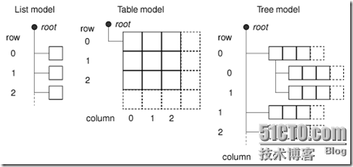

# Qt 学习之路(45): 自定义 model 之一

前面我们说了 Q t提供的几个预定义 model。但是，面对变化万千的需求，那几个 model 是远远不能满足我们的需要的。另外，对于 Qt 这种框架来说，model 的选择首先要能满足绝大多数功能的需要，这就是说，可能这个model中的某些功能你永远也不会用到，但是还要带着它，这样做的后果就是效率不会很高。所以，我们还必须要能够自定义 model。
 
在我们真正的完成自定义 model 之前，先来看看在 Qt 的 model-view 架构中的几个关键的概念。一个 model 中的每个数据元素都有一个 model 索引。这个索引指明这个数据位于 model 的位置，比如行、列等。这就是前面我们曾经说到过的 QModelIndex。每个数据元素还要有一组属性值，称为角色(roles)。这个属性值并不是数据的内容，而是它的属性，比如说，这个数据是用来展示数据的，还是用于显示列头的？因此，这组属性值实际上是 Qt 的一个 enum 定义的，比较常见的有 Qt::DisplayRole 和 Qt::EditRole，另外还有 Qt::ToolTipRole, Qt::StatusTipRole, 和Qt::WhatsThisRole 等。并且，还有一些属性是用来描述基本的展现属性的，比如 Qt::FontRole, Qt::TextAlignmentRole, Qt::TextColorRole, Qt::BackgroundColorRole 等。
 
对于 list model 而言，要定位其中的一个数据只需要有一个行号就可以了，这个行号可以通过QModelIndex::row()函数进行访问；对于 table model 而言，这种定位需要有两个值：行号和列号，这两个值可以通过 QModelIndex::row()和 QModelIndex::column()这两个函数访问到。另外，对于 tree model 而言，用于定位的可以是这个元素的父节点。实际上，不仅仅是 tree model，并且 list model 和 table model 的元素也都有自己的父节点，只不过对于 list model 和 table model，它们元素的父节点都是相同的，并且指向一个非法的 QModelIndex。对于所有的model，这个父节点都可以通过 QModelIndex::parent()函数访问到。这就是说，每个 model 的项都有自己的角色数据，0个、1个或多个子节点。既然每个元素都有自己的子元素，那么它们就可以通过递归的算法进行遍历，就像数据结构中树的遍历一样。关于父节点的描述，请看下面这张图(出自 C++ GUI Programming with Qt4, 2nd Edition)：



下面我们通过一个简单的例子来看看如何实现自定义 model。这个例子来自 C++ GUI Programming with Qt4, 2nd Edition。首先描述一下需求。这里我们要实现的是一个类似于货币汇率表的 table。或许你会想，这是一个很简单的实现，直接用 QTableWidget 不就可以了吗？的确，如果直接使用 QTableWidget 确实很方便。但是，试想一个包含了100种货币的汇率表。显然，这是一个二维表，并且，对于每一种货币，都需要给出相对于其他100种货币的汇率(在这里，我们把自己对自己的汇率也包含在内，只不过这个汇率永远是1.0000)。那么，这张表要有100 x 100 = 10000个数据项。现在要求我们减少存储空间。于是我们想，如果我们的数据不是显示的数据，而是这种货币相对于美元的汇率，那么，其他货币的汇率都可以根据这个汇率计算出来了。比如说，我存储的是人民币相对美元的汇率，日元相对美元的汇率，那么人民币相对日元的汇率只要作一下比就可以得到了。我没有必要存储10000个数据项，只要存储100个就够了。于是，我们要自己实现一个 model。
 
CurrencyModel 就是这样一个 model。它底层的数据使用一个 QMap<QString, double>类型的数据，作为 key 的 QString 是货币名字，作为 value 的 double 是这种货币对美元的汇率。然后我们来看代码：
 
.h

```

class CurrencyModel : public QAbstractTableModel 
{ 
public: 
        CurrencyModel(QObject *parent = 0); 
        void setCurrencyMap(const QMap<QString, double> &map); 
        int rowCount(const QModelIndex &parent) const; 
        int columnCount(const QModelIndex &parent) const; 
        QVariant data(const QModelIndex &index, int role) const; 
        QVariant headerData(int section, Qt::Orientation orientation, int role) const; 
private: 
        QString currencyAt(int offset) const; 
        QMap<QString, double> currencyMap; 
};
```

```
 
.cpp
CurrencyModel::CurrencyModel(QObject *parent) 
        : QAbstractTableModel(parent) 
{ 
} 
 
int CurrencyModel::rowCount(const QModelIndex & parent) const 
{ 
        return currencyMap.count(); 
} 
 
int CurrencyModel::columnCount(const QModelIndex & parent) const 
{ 
        return currencyMap.count(); 
} 
 
QVariant CurrencyModel::data(const QModelIndex &index, int role) const 
{ 
        if (!index.isValid()) 
                return QVariant(); 
 
        if (role == Qt::TextAlignmentRole) { 
                return int(Qt::AlignRight | Qt::AlignVCenter); 
        } else if (role == Qt::DisplayRole) { 
                QString rowCurrency = currencyAt(index.row()); 
                QString columnCurrency = currencyAt(index.column()); 
                if (currencyMap.value(rowCurrency) == 0.0) 
                        return "####"; 
                double amount = currencyMap.value(columnCurrency) / currencyMap.value(rowCurrency); 
                return QString("%1").arg(amount, 0, 'f', 4); 
        } 
        return QVariant(); 
} 
 
QVariant CurrencyModel::headerData(int section, Qt::Orientation orientation, int role) const 
{ 
        if (role != Qt::DisplayRole) 
                return QVariant(); 
        return currencyAt(section); 
} 
 
void CurrencyModel::setCurrencyMap(const QMap<QString, double> &map) 
{ 
        currencyMap = map; 
        reset(); 
} 
 
QString CurrencyModel::currencyAt(int offset) const 
{ 
        return (currencyMap.begin() + offset).key(); 
}
```
 
我们选择了继承 QAbstractTableModel。虽然是自定义 model，但各种 model 之间也会有很多共性。Qt 提供了一系列的抽象类供我们继承，以便让我们只需要覆盖掉几个函数就可以轻松地定义出我们自己的 model。Qt 提供了 QAbstractListModel 和 QAbstractTableModel 两类，前者是一维数据 model，后者是二维数据 model。如果你的数据很复杂，那么可以直接继承 QAbstractItemModel。这三个类之间的关系可以表述如下：(出自 C++ GUI Programming with Qt4, 2nd Edition)：


构造函数中没有添加任何代码，只要调用父类的构造函数就可以了。然后我们重写了 rowCount()和columnCount()这两个函数，用于返回 model 的行数和列数。由于我们使用一维的 map 记录数据，因此这里的行和列都是 map 的大小。然后我们看最复杂的 data()函数。
 
QVariant CurrencyModel::data(const QModelIndex &index, int role) const 
{ 
        if (!index.isValid()) 
                return QVariant(); 
 
        if (role == Qt::TextAlignmentRole) { 
                return int(Qt::AlignRight | Qt::AlignVCenter); 
        } else if (role == Qt::DisplayRole) { 
                QString rowCurrency = currencyAt(index.row()); 
                QString columnCurrency = currencyAt(index.column()); 
                if (currencyMap.value(rowCurrency) == 0.0) 
                        return "####"; 
                double amount = currencyMap.value(columnCurrency) / currencyMap.value(rowCurrency); 
                return QString("%1").arg(amount, 0, 'f', 4); 
        } 
        return QVariant(); 
}
 
data()函数返回单元格的数据。它有两个参数：第一个是 QModelIndex，也就是单元格的位置；第二个是 role，也就是这个数据的角色。这个函数的返回值是 QVariant。至此，我们还是第一次见到这个类型。这个类型相当于是 Java 里面的 Object，它把绝大多数 Qt 提供的数据类型都封装起来，起到一个数据类型“擦除”的作用。比如我们的 table 单元格可以是 string，也可以是 int，也可以是一个颜色值，那么这么多类型怎么返回呢？于是，Qt 提供了这个 QVariant 类型，你可以把这很多类型都存放进去，到需要使用的时候使用一系列的 to 函数取出来即可。比如你把 int 包装成一个QVariant，使用的时候要用 QVariant::toInt()重新取出来。这里需要注意的是，QVariant 类型的放入和取出必须是相对应的，你放入一个 int 就必须按 int 取出，不能用 toString(), Qt 不会帮你自动转换。或许你会问，Qt 不是提供了一个 QObject 类型吗？为什么不像 Java 一样都用 Object呢？关于这一点豆子也没有官方文档，不过可以猜测一下。和 Java 不同，C++的面向对象体系不是单根的，C++对象并不是都继承于某一个类，因此，如果你要实现一个这种功能的类，做到“类型擦除”，就必须用一个类包含所有的数据类型。就相当于设计一个能放进所有形状的盒子，你才能把各种各样的形状放进去。这样的话这个类就会变得异常庞大。对于 Qt，QObject 类是大多数类继承的类，理应越小越好，因此就把这个功能抽取出来，形成了一个新类。这也只是豆子的猜测，大家不必往心里去:-)
 
好了，下面看这个类的内容。首先判断传入的 index 是不是合法，如果不合法直接 return 一个空白的 QVariant。然后如果 role 是 Qt::TextAlignmentRole，也就是文本的对象方式，那么就返回int(Qt::AlignRight | Qt::AlignVCenter)；否则，role 如果是 Qt::DisplayRole，就按照我们前面所说的逻辑进行计算，然后按照字符串返回。这时候你就会发现，其实我们在 if…else…里面返回的不是一种数据类型，if 里面是 int，而 else 里面是 QString，这就是 QVariant 的作用了，也正是“类型擦除”的意思。
 
剩下的三个函数就很简单了：headerData()返回列名或者行名；setCurrencyMap()用于设置底层的数据源；currencyAt()返回偏移量为 offset 的键值。
 
至于调用就很简单了：
CurrencyTable::CurrencyTable() 
{ 
        QMap<QString, double> data; 
        data["NOK"] = 1.0000; 
        data["NZD"] = 0.2254; 
        data["SEK"] = 1.1991; 
        data["SGD"] = 0.2592; 
        data["USD"] = 0.1534; 
 
        CurrencyModel *model = new CurrencyModel; 
        model->setCurrencyMap(data); 
 
        QTableView *view = new QTableView(this); 
        view->setModel(model); 
        view->resize(400, 300); 
}
 
好了，最后让我们来看一下最终结果吧！


注意，这一章中的代码不是完整的代码，缺少 view 的头文件，不过这只是一个空白的文件。你也可以直接把 view 的代码放到 main()函数里面运行。

本文出自 “豆子空间” 博客，请务必保留此出处 [http://devbean.blog.51cto.com/448512/193918](http://devbean.blog.51cto.com/448512/193918)
