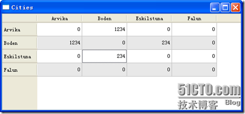

# Qt 学习之路(46): 自定义 model 之二

前面的例子已经比较清楚的给出了自定义 model 的方法，就是要覆盖我们所需要的那几个函数就可以了。但是，前面的例子仅仅是简单的展示数据，也就是说数据时只读的。那么，如何能做到读写数据呢？那就要来看进来的例子了。这个例子也是来自 C++GUI Programming with Qt 4, 2nd Edition这本书的。
 
还是先来看代码吧：
 
citymodel.h

```
 
class CityModel : public QAbstractTableModel 
{ 
        Q_OBJECT 
 
public: 
        CityModel(QObject *parent = 0); 
 
        void setCities(const QStringList &cityNames); 
        int rowCount(const QModelIndex &parent) const; 
        int columnCount(const QModelIndex &parent) const; 
        QVariant data(const QModelIndex &index, int role) const; 
        bool setData(const QModelIndex &index, const QVariant &value, int role); 
        QVariant headerData(int section, Qt::Orientation orientation, int role) const; 
        Qt::ItemFlags flags(const QModelIndex &index) const; 
 
private: 
        int offsetOf(int row, int column) const; 
 
        QStringList cities; 
        QVector<int> distances; 
};
``` 
 
```

citymodel.cpp
CityModel::CityModel(QObject *parent) 
        : QAbstractTableModel(parent) 
{ 
} 
 
int CityModel::rowCount(const QModelIndex & parent) const 
{ 
        return cities.count(); 
} 
 
int CityModel::columnCount(const QModelIndex & parent) const 
{ 
        return cities.count(); 
} 
 
QVariant CityModel::data(const QModelIndex &index, int role) const 
{ 
        if (!index.isValid()) { 
                return QVariant(); 
        } 
 
        if (role == Qt::TextAlignmentRole) { 
                return int(Qt::AlignRight | Qt::AlignVCenter); 
        } else if (role == Qt::DisplayRole) { 
                if (index.row() == index.column()) { 
                        return 0; 
                } 
                int offset = offsetOf(index.row(), index.column()); 
                return distances[offset]; 
        } 
        return QVariant(); 
} 
 
QVariant CityModel::headerData(int section, Qt::Orientation orientation, int role) const 
{ 
        if (role == Qt::DisplayRole) { 
                return cities[section]; 
        } 
        return QVariant(); 
} 
 
bool CityModel::setData(const QModelIndex &index, const QVariant &value, int role) 
{ 
        if (index.isValid() && index.row() != index.column() && role == Qt::EditRole) { 
                int offset = offsetOf(index.row(), index.column()); 
                distances[offset] = value.toInt(); 
 
                QModelIndex transposedIndex = createIndex(index.column(), index.row()); 
                emit dataChanged(index, index); 
                emit dataChanged(transposedIndex, transposedIndex); 
                return true; 
        } 
        return false; 
} 
 
Qt::ItemFlags CityModel::flags(const QModelIndex &index) const 
{ 
        Qt::ItemFlags flags = QAbstractItemModel::flags(index); 
        if (index.row() != index.column()) { 
                flags |= Qt::ItemIsEditable; 
        } 
        return flags; 
} 
 
void CityModel::setCities(const QStringList &cityNames) 
{ 
        cities = cityNames; 
        distances.resize(cities.count() * (cities.count() - 1) / 2); 
        distances.fill(0); 
        reset(); 
} 
 
int CityModel::offsetOf(int row, int column) const 
{ 
        if (row < column) { 
                qSwap(row, column); 
        } 
        return (row * (row - 1) / 2) + column; 
} 
```
 
代码很长，但实际上和前面我们的那个例子非常相似。这个 model 也是用于 table 的，因此还是继承了QAbstractTableModel。CityModel 内部有两个数据源：一个 QStringList 类型的对象，一个QVector&lt;int>类型的对象。前者用于保存城市的名字，需要用户显示的给出；后者是 model 内部维护的一个存放 int 的向量。这个 CityModel 就是要在 table 中显示两个城市之间的距离。同前面的例子一样，如果我们要把所有的数据都保存下来，显然会造成数据的冗余：城市 A 到城市 B 的距离同城市 B 到城市 A 的距离是一样的！因此我们还是自定义一个 model。同样这个 CityModel 有个简单的空构造函数，rowCount()和 columnCount()函数也是返回 list 的长度。data()函数根据 role 的不同返回不同的值。由于在 table 中坐标是由 row 和 column 给出的，因此需要有一个二维坐标到一维坐标的转换，这就是 offsetOf()函数的作用。我们把主要精力放在 setData()函数上面。

```
 
bool CityModel::setData(const QModelIndex &index, const QVariant &value, int role) 
{ 
        if (index.isValid() && index.row() != index.column() && role == Qt::EditRole) { 
                int offset = offsetOf(index.row(), index.column()); 
                distances[offset] = value.toInt(); 
 
                QModelIndex transposedIndex = createIndex(index.column(), index.row()); 
                emit dataChanged(index, index); 
                emit dataChanged(transposedIndex, transposedIndex); 
                return true; 
        } 
        return false; 
}
```
 
这个函数在用户编辑数据时会自动调用。也就是说，这时我们的数据已经不是只读的了。函数开始是一个长长的判断：index 要是合法的；index 的 row 和 column 不相等，也就是说两个城市是不同的；数据想的 role是 Qt::EditRole。如果满足了这三个条件，才会执行下面的操作。首先，由 row 和 column 坐标定位到表中的数据项在 vector 中的位置。然后用户新修改的数据被作为参数 value 传入，所以我们要把这个参数赋值给 distances。createIndex()函数根据 column 和 row 值生成一个 QModelIndex 对象。请注意这里的顺序：row 和 column 是颠倒的！这就把坐标为(row, column)的点关于主对角线对称的那个点(column, row)的 index 找到了。还记得我们的需求吗？当我们修改了一个数据时，对应的数据也要被修改，这就是这个功能的实现。我们需要 emit dataChanged()信号，这个信号接收两个参数：一个是被修改的数据的左上角的坐标，一个是被修改的数据的右下角的坐标。为什么会有两个坐标呢？因此我们修改的数据不一定只是一个。像这里，我们只修改了一个数据，因此这两个值是相同的。数据更新了，我们用这个信号通知 view 刷新，这样就可以显示新的数据了。最后，如果函数数据修改成功就返回 true，否则返回 false。
 
最后，我们在 main()函数中显示出来这个 model：

```
 
int main(int argc, char *argv[]) 
{ 
        QApplication a(argc, argv); 
        QStringList cities; 
        cities << "Arvika" << "Boden" << "Eskilstuna" << "Falun"; 
 
        CityModel cityModel; 
        cityModel.setCities(cities); 
 
        QTableView tableView; 
        tableView.setModel(&cityModel); 
        tableView.setAlternatingRowColors(true); 
        tableView.setWindowTitle(QObject::tr("Cities")); 
        tableView.show(); 
        return a.exec(); 
}
```
 
这样，我们就把这个 model 做完了。最后来看看效果吧！



本文出自 “豆子空间” 博客，请务必保留此出处 [http://devbean.blog.51cto.com/448512/193918](http://devbean.blog.51cto.com/448512/193918)