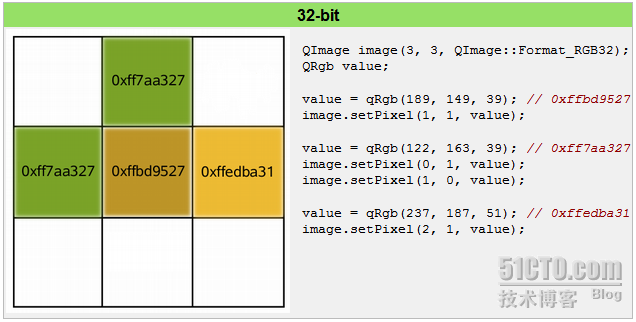

# Qt 学习之路(29): 绘图设备

绘图设备是指继承 QPainterDevice 的子类。Qt 一共提供了四个这样的类，分别是 QPixmap、QBitmap、QImage 和 QPicture。其中，QPixmap 专门为图像在屏幕上的显示做了优化，而 QBitmap是 QPixmap 的一个子类，它的色深限定为1，你可以使用 QPixmap 的 isQBitmap()函数来确定这个QPixmap 是不是一个 QBitmap。QImage 专门为图像的像素级访问做了优化。QPicture 则可以记录和重现 QPainter 的各条命令。下面我们将分两部分介绍这四种绘图设备。

QPixmap 继承了 QPaintDevice，因此，你可以使用 QPainter 直接在上面绘制图形。QPixmap 也可以接受一个字符串作为一个文件的路径来显示这个文件，比如你想在程序之中打开 png、jpeg 之类的文件，就可以使用 QPixmap。使用 QPainter 的 drawPixmap()函数可以把这个文件绘制到一个QLabel、QPushButton 或者其他的设备上面。QPixmap 是针对屏幕进行特殊优化的，因此，它与实际的底层显示设备息息相关。注意，这里说的显示设备并不是硬件，而是操作系统提供的原生的绘图引擎。所以，在不同的操作系统平台下，QPixmap 的显示可能会有所差别。
 
QPixmap 提供了静态的 grabWidget()和 grabWindow()函数，用于将自身图像绘制到目标上。同时，在使用 QPixmap 时，你可以直接使用传值也不需要传指针，因为 QPixmap 提供了“隐式数据共享”。关于这一点，我们会在以后的章节中详细描述，这里只要知道传递 QPixmap 不必须使用指针就好了。 

 
QBitmap 继承自 QPixmap，因此具有 QPixmap 的所有特性。QBitmap 的色深始终为1. 色深这个概念来自计算机图形学，是指用于表现颜色的二进制的位数。我们知道，计算机里面的数据都是使用二进制表示的。为了表示一种颜色，我们也会使用二进制。比如我们要表示8种颜色，需要用3个二进制位，这时我们就说色深是3. 因此，所谓色深为1，也就是使用1个二进制位表示颜色。1个位只有两种状态：0和1，因此它所表示的颜色就有两种，黑和白。所以说，QBitmap 实际上是只有黑白两色的图像数据。
 
由于 QBitmap 色深小，因此只占用很少的存储空间，所以适合做光标文件和笔刷。
 
下面我们来看同一个图像文件在 QPixmap 和 QBitmap 下的不同表现：

```
void PaintedWidget::paintEvent(QPaintEvent *event) 
{ 
        QPainter painter(this); 
        QPixmap pixmap("Cat.png"); 
        QBitmap bitmap("Cat.png"); 
        painter.drawPixmap(10, 10, 128, 128, pixmap); 
        painter.drawPixmap(140, 10, 128, 128, bitmap); 
        QPixmap pixmap2("Cat2.png"); 
        QBitmap bitmap2("Cat2.png"); 
        painter.drawPixmap(10, 140, 128, 128, pixmap2); 
        painter.drawPixmap(140, 140, 128, 128, bitmap2); 
}
```

先来看一下运行结果：


这里我们给出了两张 png 图片。Cat.png 是没有透明色的纯白背景，而 Cat2.png 是具有透明色的背景。我们分别使用 QPixmap 和 QBitmap 来加载它们。注意看它们的区别：白色的背景在 Qbitmap 中消失了，而透明色在 QBitmap 中转换成了黑色；其他颜色则是使用点的疏密程度来体现的。
 
QPixmap 使用底层平台的绘制系统进行绘制，无法提供像素级别的操作，而 QImage 则是使用独立于硬件的绘制系统，实际上是自己绘制自己，因此提供了像素级别的操作，并且能够在不同系统之上提供一个一致的显示形式。



如上图所示(出自 Qt API 文档)，我们声明了一个 QImage 对象，大小是3 x 3，颜色模式是 RGB32，即使用32位数值表示一个颜色的RGB值，也就是说每种颜色使用8位。然后我们对每个像素进行颜色赋值，从而构成了这个图像。你可以把 QImage 想象成一个 RGB 颜色的二维数组，记录了每一像素的颜色。
 
最后一个需要说明的是 QPicture。这是一个可以记录和重现 QPainter 命令的绘图设备。QPicture将 QPainter 的命令序列化到一个 IO 设备，保存为一个平台独立的文件格式。这种格式有时候会是“元文件(meta-files)”。Qt 的这种格式是二进制的，不同于某些本地的元文件，Qt 的 pictures文件没有内容上的限制，只要是能够被 QPainter 绘制的元素，不论是字体还是 pixmap，或者是变换，都可以保存进一个 picture 中。
 
QPicture 是平台无关的，因此它可以使用在多种设备之上，比如 svg、pdf、ps、打印机或者屏幕。回忆下我们这里所说的 QPaintDevice，实际上是说可以有 QPainter 绘制的对象。QPicture 使用系统的分辨率，并且可以调整 QPainter 来消除不同设备之间的显示差异。
 
如果我们要记录下 QPainter 的命令，首先要使用 QPainter::begin()函数，将 QPicture 实例作为参数传递进去，以便告诉系统开始记录，记录完毕后使用 QPainter::end()命令终止。代码示例如下：

```
QPicture picture; 
QPainter painter; 
painter.begin(&picture);              // paint in picture 
painter.drawEllipse(10,20, 80,70); // draw an ellipse 
painter.end();                           // painting done 
picture.save("drawing.pic");         // save picture
```

如果我们要重现命令，首先要使用 QPicture::load()函数进行装载：

```
QPicture picture; 
picture.load("drawing.pic");          // load picture 
QPainter painter; 
painter.begin(&myImage);            // paint in myImage 
painter.drawPicture(0, 0, picture); // draw the picture at (0,0) 
painter.end(); 
```

本文出自 “豆子空间” 博客，请务必保留此出处 [http://devbean.blog.51cto.com/448512/194031](http://devbean.blog.51cto.com/448512/194031)