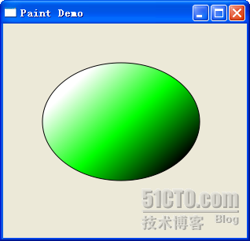
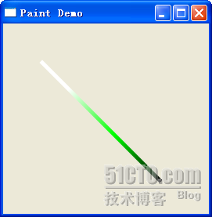

# Qt 学习之路(27): 渐变填充

前面说了有关反走样的相关知识，下面来说一下渐变。渐变是绘图中很常见的一种功能，简单来说就是可以把几种颜色混合在一起，让它们能够自然地过渡，而不是一下子变成另一种颜色。渐变的算法比较复杂，写得不好的话效率会很低，好在很多绘图系统都内置了渐变的功能，Qt 也不例外。渐变一般是用在填充里面的，所以，渐变的设置就是在 QBrush 里面。

Qt 提供了三种渐变画刷，分别是线性渐变(QLinearGradient)、辐射渐变(QRadialGradient)、角度渐变(QConicalGradient)。如下图所示(图片出自 C++ GUI Programming with Qt4, 2nd Edition)：


下面我们来看一下线性渐变 QLinearGradient 的用法。

```
void PaintedWidget::paintEvent(QPaintEvent *event) 
{ 
        QPainter painter(this); 
 
        painter.setRenderHint(QPainter::Antialiasing, true); 
        QLinearGradient linearGradient(60, 50, 200, 200); 
        linearGradient.setColorAt(0.2, Qt::white); 
        linearGradient.setColorAt(0.6, Qt::green); 
        linearGradient.setColorAt(1.0, Qt::black); 
        painter.setBrush(QBrush(linearGradient)); 
        painter.drawEllipse(50, 50, 200, 150); 
}
```

同前面一样，这里也仅仅给出了 paintEvent()函数里面的代码。
 
首先我们打开了反走样，然后创建一个 QLinearGradient对象实例。QLinearGradient 构造函数有四个参数，分别是x1, y1, x2, y2，即渐变的起始点和终止点。在这里，我们从(60, 50)开始渐变，到(200, 200)止。
 
渐变的颜色是在 setColorAt()函数中指定的。下面是这个函数的签名：

```
void QGradient::setColorAt ( qreal position, const QColor & color )
```

它的意思是把 position 位置的颜色设置成 color。其中，position 是一个0 - 1区间的数字。也就是说，position 是相对于我们建立渐变对象时做的那个起始点和终止点区间的。比如这个线性渐变，就是说，在从(60, 50)到(200, 200)的线段上，在0.2，也就五分之一处设置成白色，在0.6也就是五分之三处设置成绿色，在1.0也就是终点处设置成黑色。
 
在创建 QBrush 时，把这个渐变对象传递进去，就是我们的结果啦：
 


那么，我们怎么让线段也是渐变的呢？要知道，直线是用画笔绘制的啊！这里，如果你仔细查阅了 API 文档就会发现，QPen 是接受 QBrush 作为参数的。也就是说，你可以利用一个 QBrush 创建一个QPen，这样，QBrush 所有的填充效果都可以用在画笔上了！
 
```
void PaintedWidget::paintEvent(QPaintEvent *event) 
{ 
        QPainter painter(this); 
 
        painter.setRenderHint(QPainter::Antialiasing, true); 
        QLinearGradient linearGradient(60, 50, 200, 200); 
        linearGradient.setColorAt(0.2, Qt::white); 
        linearGradient.setColorAt(0.6, Qt::green); 
        linearGradient.setColorAt(1.0, Qt::black); 
        painter.setPen(QPen(QBrush(linearGradient), 5)); 
        painter.drawLine(50, 50, 200, 200); 
}
```

看看我们的渐变线吧！



本文出自 “豆子空间” 博客，请务必保留此出处 [http://devbean.blog.51cto.com/448512/194031](http://devbean.blog.51cto.com/448512/194031)