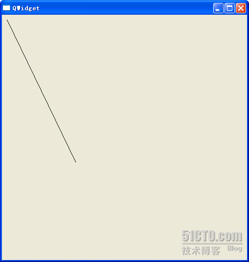

# Qt 学习之路(30): Graphics View Framework

现在基本上也已经到了2D 绘图部分的尾声，所谓重头戏都是在最后压轴的，现在我们就要来看看在绘图部分功能最强大的 Graphics View。我们经常说 KDE 桌面，新版本的 KDE 桌面就是建立在 Graphics View 的基础之上，可见其强大之处。
 
Qt 的白皮书里面这样写道：“Qt Graphics View 提供了用于管理和交互大量定制的 2D 图形对象的平面以及可视化显示对象的视图 widget，并支持缩放和旋转功能。Graphics View 使用 BSP（二进制空间划分）树形可非常快速地找到对象，因此即使是包含百万个对象的大型场景，也能实时图形化显示。”
 
Graphics View 是一个基于 item 的 M-V 架构的框架。
 
基于 item 意思是，它的每一个组件都是一个 item。这是与 QPainter 的状态机不同。回忆一下，使用 QPainter 绘图多是采用一种面向过程的描述方式，首先使用 drawLine()画一条直线，然后使用drawPolygon()画一个多边形；而对于 Graphics View 来说，相同的过程可以是，首先创建一个场景scene，然后创建一个 line 对象和一个 polygon 对象，再使用 scene 的 add()函数将 line 和polygon 添加到 scene，最后通过视口 view 就可以看到了。乍看起来，后者似乎更加复杂，但是，如果你的图像中包含了成千上万的直线、多边形之类，管理这些对象要比管理 QPainter 的 draw 语句容易得多。并且，这些图形对象也更加符合面向对象的设计要求：一个很复杂的图形可以很方便的复用。
 
M-V 架构的意思是，Graphics View 提供一个 model 和一个 view。所谓 model 就是我们添加的种种对象，所谓 view 就是我们观察这些对象的视口。同一个 model 可以由很多 view 从不同的角度进行观察，这是很常见的需求。使用 QPainter 就很难实现这一点，这需要很复杂的计算，而 Qt 的Graphics View 就可以很容易的实现。
 
Graphics View 提供了一个 QGraphicsScene 作为场景，即是我们添加图形的空间，相当于整个世界；一个 QGraphicsView 作为视口，也就是我们观察的窗口，相当于照相机的取景框，这个取景框可以覆盖整个场景，也可以是场景的一部分；一些 QGraphicsItem 作为图形元件，以便 scene 添加，Qt 内置了很多图形，比如 line、polygon 等，都是继承自 QGraphicsItem。
 
下面我们来看一下代码：

```
#include <QtGui> 
 
class DrawApp : public QWidget { 
public: 
        DrawApp(); 
protected: 
        void paintEvent(QPaintEvent *event); 
}; 
 
DrawApp::DrawApp() 
{ 
 
} 
 
void DrawApp::paintEvent(QPaintEvent *event) 
{ 
        QPainter painter(this); 
        painter.drawLine(10, 10, 150, 300); 
} 
 
int main(int argc, char *argv[]) 
{ 
        QApplication a(argc, argv); 
        QGraphicsScene *scene = new QGraphicsScene; 
        scene->addLine(10, 10, 150, 300); 
        QGraphicsView *view = new QGraphicsView(scene); 
        view->resize(500, 500); 
        view->setWindowTitle("Graphics View"); 
        view->show(); 
 
        DrawApp *da = new DrawApp; 
        da->resize(500, 500); 
        da->setWindowTitle("QWidget"); 
        da->show(); 
        return a.exec(); 
}
```

为了突出重点，我们就直接 include 了 QtGui，不过在实际应用中不建议这么做。这里提供了直线的两种实现：一个是 DrawApp 使用我们前面介绍的技术，重写 paintEvent()函数，这里就不在赘述，重点来看 main()函数里面的实现。
 
首先，我们创建了一个 QGraphicsScene 作为场景，然后在 scene 中添加了一个直线，这样就把我们需要的图形元件放到了 scene 中。然后创建一个 QGraphicsView 对象进行观察。就这样，我们就是用 Graphics View 搭建了一个最简单的应用。运行这个程序来看结果：




第一张图是 Graphics View 的，第二个是 DrawApp 的。虽然这两个直线是同样的坐标，但是，DrawApp 按照原始坐标绘制出了直线，而 Graphics View 则按照坐标绘制出直线之后，自动将直线居中显示在 view 视口。你可以通过拖动 Graphics View 来看直线是一直居中显示的。
 
这里仅仅是一个很简单的对比，不过你已经可以看到 Graphics View 功能的强大。仅这一个居中的操作，如果你是用 QPainter，就需要很大的计算量了！当然，如果你不需要这种居中，Graphics View也是可以像 QPainter 绘制的一样进行显示的。

本文出自 “豆子空间” 博客，请务必保留此出处 [http://devbean.blog.51cto.com/448512/194031](http://devbean.blog.51cto.com/448512/194031)