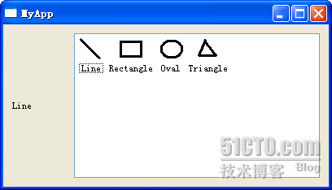

# Qt 学习之路(39): QListWidget

前面一节简单概述著名的 MVC 模式在 Qt 中的实现，现在我们从 QListWidget 开始了解 Qt 提供的一系列方便的 item view 类。
 
第一个要说的是 QListWidget。这个类为我们展示一个 List 列表的视图。下面还是先看代码：

```
 
listwidget.h
#ifndef LISTWIDGET_H 
#define LISTWIDGET_H 
 
#include <QtGui> 
 
class ListWidget : public QWidget 
{ 
public: 
        ListWidget(); 
 
private: 
        QLabel *label; 
        QListWidget *list; 
}; 
 
#endif // LISTWIDGET_H
```
 
listwidget.cpp

```

#include "listwidget.h" 
 
ListWidget::ListWidget() 
{ 
        label = new QLabel; 
        label->setFixedWidth(70); 
        list = new QListWidget; 
        list->addItem(new QListWidgetItem(QIcon(":/images/line.PNG"), tr("Line"))); 
        list->addItem(new QListWidgetItem(QIcon(":/images/rect.PNG"), tr("Rectangle"))); 
        list->addItem(new QListWidgetItem(QIcon(":/images/oval.PNG"), tr("Oval"))); 
        list->addItem(new QListWidgetItem(QIcon(":/images/tri.PNG"), tr("Triangle"))); 
        QHBoxLayout *layout = new QHBoxLayout; 
        layout->addWidget(label); 
        layout->addWidget(list); 
 
        setLayout(layout); 
 
        connect(list, SIGNAL(currentTextChanged(QString)), label, SLOT(setText(QString))); 
}
```

main.cpp

```

#include <QtGui> 
#include "listwidget.h" 
 
int main(int argc, char *argv[]) 
{ 
        QApplication a(argc, argv); 
        ListWidget lw; 
        lw.resize(400, 200); 
        lw.show(); 
        return a.exec(); 
}
```

一共三个文件，但是都比较清晰。我们先建立了一个 ListWidget 类，然后在 main 函数中将其显示出来。
 
ListWidget 类中包含一个 QLabel 对象和一个 QListWidget 对象。创建这个 QListWidget 对象很简单，只需要使用new运算符创建出来，然后调用 addItem()函数即可将 item 添加到这个对象中。我们添加的对象是 QListWidgetItem 的指针，它有四个重载的函数，我们使用的是其中的一个，它接受两个参数，第一个是 QIcon 引用类型，作为 item 的图标，第二个是 QString 类型，作为这个item 后面的文字说明。当然，我们也可以使用 insertItem()函数在特定的位置动态的增加 item，具体使用请查阅 API 文档。最后，我们将这个 QListWidget 的 currentTextChanged()信号同QLabel 的 setText()连接起来，这样，在我们点击 item 的时候，label 上面的文字就可以改变了。


我们还可以设置 viewModel 这个参数，来确定使用不同的视图进行显示。比如，我们使用下面的语句：

```
 
list->setViewMode(QListView::IconMode);
```

再来看看程序界面吧！



本文出自 “豆子空间” 博客，请务必保留此出处 [http://devbean.blog.51cto.com/448512/193918](http://devbean.blog.51cto.com/448512/193918)